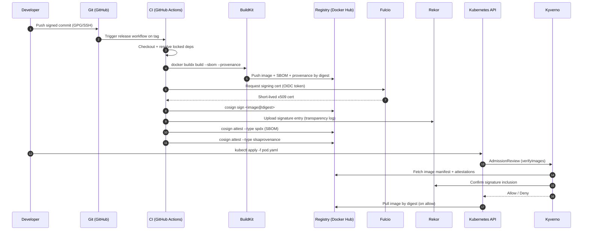

# Secure software supply chain for Docker images

End-to-end recipe for the steps that happen _after_ `docker build`: generate an
SBOM, sign the image, sign the SBOM, generate SLSA build provenance, and verify
all of the above at admission time.

This doc is opinionated. The recommended default is:

- **Sigstore Cosign** for signing, keyless (GitHub OIDC).
- **SPDX 2.3** SBOMs (broadest tool support), generated by BuildKit's native
  `--sbom=true` for new builds and Syft for retrofits.
- **SLSA v1.0** build provenance, attached as a Cosign attestation.
- **Kyverno `verifyImages`** for Kubernetes admission control.

Every command below is copy-paste-runnable against a public registry
(Docker Hub) without a paid subscription.

## Why this matters

The Dockerfiles in this repo already aim for supply-chain hygiene — pinned
bases, locked dependencies, `--require-hashes`, hadolint-clean. That covers the
build inputs. It does not cover what happens between `docker push` and
`docker pull` on a production node.

**Threats this pipeline addresses:**

- Typo-squatted or backdoored dependencies sneaking into a builder.
- Base-image compromise (pinning by tag is not pinning).
- Registry tampering (someone overwrites `:latest` or a mutable tag).
- Build-system compromise (an attacker without source access produces a "valid"
  image and pushes it).
- Operator confusion ("which image actually ran in prod last Tuesday?").

**Threats this pipeline does not address:**

- Developer machine compromise before the commit is signed.
- Vulnerabilities in correctly-attested code (that is what scanners are for —
  see _Scanning vs. attestation_ below).
- Insider abuse of the OIDC identity that is allowed to sign.

## End-to-end flow

The diagram below traces a single commit from a developer's machine to a
running pod, with every artifact the pipeline produces. Each numbered arrow
is explained in the table that follows: **why** the step exists, **what
artifact** it produces (and where it is stored), and **how to verify** the
artifact independently.



**Step-by-step:**

| #   | Step                                    | Why                                                                                                                                                | Artifact (where stored)                                                              | How to verify                                                                                                                                                     |
| --- | --------------------------------------- | -------------------------------------------------------------------------------------------------------------------------------------------------- | ------------------------------------------------------------------------------------ | ----------------------------------------------------------------------------------------------------------------------------------------------------------------- |
| 1   | Push signed commit                      | Anchors the chain in a cryptographic statement of authorship; protected-branch rules can require it.                                               | Commit object with `gpgsig` header (in `.git/`, replicated to GitHub).               | `git log --show-signature <ref>` or check the green "Verified" badge on the commit in GitHub.                                                                     |
| 2   | Trigger release workflow                | A single sanctioned path produces release artifacts; ad-hoc builds cannot mint signatures.                                                         | Workflow run record (GitHub Actions).                                                | `gh run view <id>` or `gh run list --workflow=release.yml`. Provenance later pins this run ID.                                                                    |
| 3   | Checkout + resolve locked deps          | Locks the dependency graph to exactly what is committed — no resolver surprises mid-pipeline.                                                      | Resolved lockfile contents in the runner's workspace; no persistent artifact.        | Re-run `uv sync --frozen` / `npm ci` locally on the same commit and diff the resolved tree.                                                                       |
| 4   | `docker buildx build`                   | Produces the image; BuildKit attaches the SBOM and SLSA-style provenance as in-toto attestations inline.                                           | OCI image, SPDX SBOM, provenance — all under the image digest.                       | `docker buildx imagetools inspect owner/img@sha256:<digest> --format '{{json .SBOM}}'`.                                                                           |
| 5   | Push image + attestations               | Makes the digest globally addressable; downstream steps only ever reference the digest.                                                            | Image manifest at `owner/img@sha256:<digest>` plus referrer artifacts on Docker Hub. | `docker manifest inspect owner/img@sha256:<digest>`; `cosign tree owner/img@sha256:<digest>` lists every referrer.                                                |
| 6   | Request OIDC token → Fulcio             | Proves the signer's identity without a long-lived key; ties the upcoming signature to this exact workflow.                                         | OIDC JWT (in-memory only, never written).                                            | Inspect the run's `id-token` permission in the workflow file; the token is short-lived and not persisted.                                                         |
| 7   | Fulcio returns x509 cert                | A ~10-minute certificate binding the OIDC subject (workflow URL) to a public key Cosign just generated.                                            | Code-signing cert (embedded in the Cosign signature object on the registry).         | `cosign verify --certificate-identity-regexp … --certificate-oidc-issuer …` re-parses this cert chain.                                                            |
| 8   | `cosign sign <image@digest>`            | Produces the signature over the image digest — the actual "this image is ours" claim.                                                              | `sha256-<digest>.sig` referrer artifact on the registry.                             | `cosign verify --certificate-identity-regexp '…release\.yml@.*' --certificate-oidc-issuer https://token.actions.githubusercontent.com owner/img@sha256:<digest>`. |
| 9   | Upload signature to Rekor               | Public transparency log entry — anyone (including auditors and Kyverno) can later prove this signature existed at this time.                       | Rekor log entry (UUID + inclusion proof, also referenced in the signature).          | `rekor-cli search --artifact owner/img@sha256:<digest>` or `cosign verify --rekor-url …`.                                                                         |
| 10  | `cosign attest --type spdx`             | Binds the SBOM to the image digest as a signed statement, not a loose file on a server somewhere.                                                  | SPDX in-toto attestation, stored as a referrer on the registry; logged in Rekor.     | `cosign verify-attestation --type spdx --certificate-identity-regexp … owner/img@sha256:<digest>`.                                                                |
| 11  | `cosign attest --type slsaprovenance`   | Provenance is what makes "built by our pipeline" enforceable in admission policy; without it, signatures only prove "by someone we trust to sign". | SLSA provenance in-toto attestation; same storage path as the SBOM attestation.      | `cosign verify-attestation --type slsaprovenance … owner/img@sha256:<digest> \| jq '.payload \| @base64d \| fromjson'` to inspect `builder.id`.                   |
| 12  | `kubectl apply -f pod.yaml`             | The deployment moment — where policy gets to make a decision.                                                                                      | Pod spec submitted to the API server (referenced image string).                      | `kubectl get pod <name> -o jsonpath='{.spec.containers[*].image}'` — should be a digest, not a tag.                                                               |
| 13  | API → Kyverno AdmissionReview           | Synchronous gate; if Kyverno denies, the pod is never persisted.                                                                                   | AdmissionReview request (in-flight only).                                            | `kubectl get clusterpolicy require-signed-images -o yaml`; `kubectl get events --field-selector reason=PolicyViolation`.                                          |
| 14  | Kyverno fetches manifest + attestations | Kyverno needs the actual artifacts to verify against policy — it does not trust the submitter's claims.                                            | Read-only registry fetch; no new artifact.                                           | Enable Kyverno's audit logs (`--logging.verbosity=4`) to trace which referrers it pulled.                                                                         |
| 15  | Confirm Rekor inclusion                 | Closes the loop: even if a signature is on the registry, Kyverno checks it was publicly logged at sign time.                                       | Rekor inclusion proof (verified in memory).                                          | `kubectl logs -n kyverno deploy/kyverno-admission-controller \| grep verifyImages`.                                                                               |
| 16  | Allow / Deny                            | The enforcement point. A denied pod never runs; an allowed pod is now provably traceable back to step 1.                                           | Kubernetes Event + admission decision.                                               | `kubectl describe pod <name>` — denied pods carry a Kyverno reason; allowed pods carry the verified digest.                                                       |
| 17  | Pull image by digest                    | The node pulls exactly the bytes that were signed — not whatever the tag resolves to today.                                                        | Image layers in the node's container store.                                          | `crictl inspecti <imageID>` on the node; the digest matches what Kyverno verified.                                                                                |

Each row is independently checkable. If step 8's `cosign verify` fails on a
running image, step 16 should never have happened — that gap is the
admission-controller bug you actually want to know about.

## The supply-chain pipeline

Five stages. Each one is independently verifiable.

### 1. Source integrity

Lockfiles with hashes are the floor. Floating version ranges (`^1.2.3`,
`~=1.4`, `latest`) are a supply-chain bug — they mean the artifact you build
tomorrow is not the artifact you built today, even from the same source tree.

- **Python:** `uv.lock` + `uv sync --frozen`, `poetry.lock` + `poetry install
--no-root --only main`, or `requirements.txt` generated with `pip-compile
--generate-hashes` and installed with `pip install --require-hashes`.
- **Node / TypeScript:** `package-lock.json` (npm) or `pnpm-lock.yaml` with
  `npm ci` / `pnpm install --frozen-lockfile`. Lockfiles include integrity
  hashes by default.
- **Rust:** `Cargo.lock` committed for binaries; `cargo build --locked`.
- **Go:** `go.sum` committed; `GOFLAGS=-mod=readonly`.

Sign commits and require signed commits on protected branches:

```sh
git config --global commit.gpgsign true   # or gpg.format=ssh for SSH signing
```

GitHub: _Settings → Branches → Add rule → Require signed commits_ on `main`.

### 2. Build reproducibility

Pin every input to the build, not just the application's dependency graph.

- **Base image by digest, not tag.** Tags move. Digests do not.

  ```dockerfile
  FROM gcr.io/distroless/python3-debian12@sha256:<digest>
  ```

- **Pin tools installed in the builder** (uv, poetry, pip, build-essential
  versions). For `apt-get install`, pin major versions; for installer scripts,
  pin a release tag and verify a checksum.
- **Freeze the resolver.** `uv sync --frozen`, `pip install --require-hashes`,
  `poetry install --no-root --only main` against a committed lockfile.

`SOURCE_DATE_EPOCH` and BuildKit's deterministic output help with **layer
hash** reproducibility (mtimes, file ordering); they do not by themselves make
a non-deterministic build deterministic. If your build runs a code generator
that embeds timestamps, fix the generator.

To check "did this rebuild byte-for-byte?":

```sh
docker buildx build --output type=oci,dest=image.tar . > /dev/null
sha256sum image.tar
```

Run twice from a clean state; the hashes must match.

### 3. SBOM generation

An SBOM is the manifest. It says exactly which packages, at which versions,
ended up in the image. Tooling options:

| Tool                   | Strength                                                   | Caveat                                                    |
| ---------------------- | ---------------------------------------------------------- | --------------------------------------------------------- |
| BuildKit `--sbom=true` | Native, runs during build, pushes SBOM as an OCI referrer. | Requires `docker buildx` + a BuildKit ≥ 0.11 builder.     |
| Syft                   | Retrofits any existing image. SPDX or CycloneDX output.    | External step; remember to attest the output.             |
| `trivy sbom`           | Bundled with the scanner most teams already run.           | Output quality lags Syft for some ecosystems.             |
| `docker scout sbom`    | Convenient on Docker Desktop.                              | Vendor-coupled; do not rely on it for portable pipelines. |

**Default: BuildKit native for new builds, Syft for retrofits.**

```sh
# New build: BuildKit attaches the SBOM as an OCI referrer.
docker buildx build \
  --sbom=true \
  --provenance=mode=max \
  --output type=image,push=true \
  -t owner/img:1.2.3 .

# Retrofit: generate an SBOM for an already-pushed image.
syft owner/img@sha256:<digest> -o spdx-json > sbom.spdx.json
```

**Format choice: SPDX 2.3.** Broader tool support than CycloneDX (which is
fine; just pick one and be consistent). The downstream verifier needs to know
which `--type` to expect.

### 4. Image signing with Cosign

Cosign supports two modes: **keyless** (OIDC-based, short-lived certificates,
public transparency log) and **key-based** (long-lived signing key, optionally
KMS-backed). Both produce signatures that live alongside the image in the
registry; the verification command differs.

**Always sign digests, never tags.** A tag is a moving pointer; a signed tag
verifies only the digest the tag pointed to _at signing time_, which buys you
nothing once the tag is updated.

#### Option A — Keyless (recommended)

The signer authenticates to an OIDC provider (GitHub Actions, GitLab CI,
Google, generic OIDC). Sigstore's Fulcio mints a short-lived x509 certificate
bound to that identity; the signature and certificate land in the Rekor
public transparency log. No long-lived key to rotate, lose, or leak.

```sh
# Sign by digest. In CI, --yes skips the interactive confirmation.
cosign sign owner/img@sha256:<digest>

# Attest the SBOM (SPDX).
cosign attest \
  --predicate sbom.spdx.json \
  --type spdx \
  owner/img@sha256:<digest>

# Verify, anchoring identity to the workflow that was allowed to sign.
cosign verify \
  --certificate-identity-regexp 'https://github.com/owner/repo/.github/workflows/release\.yml@.*' \
  --certificate-oidc-issuer https://token.actions.githubusercontent.com \
  owner/img@sha256:<digest>
```

The `--certificate-identity*` and `--certificate-oidc-issuer` flags are what
actually enforce trust — without them, you are verifying "somebody, somewhere
signed this" rather than "our release workflow signed this".

#### Option B — Key-based

Generate a Cosign key pair (or use a KMS-backed key) and sign with the
private half. Verifiers check signatures against the public half. No OIDC,
no transparency log entry by default (you can opt in to Rekor with
`COSIGN_EXPERIMENTAL=1`).

Useful when:

- The build environment cannot reach a public OIDC provider (air-gapped CI,
  on-prem only).
- An existing KMS (AWS KMS, GCP KMS, Azure Key Vault, HashiCorp Vault) is
  already the policy boundary for signing material.
- Regulatory requirements mandate a named, auditable signing key rather than
  an ephemeral identity.

Generate a local key pair (development / small teams):

```sh
# Generates cosign.key (encrypted) and cosign.pub. Set COSIGN_PASSWORD or
# enter the passphrase interactively.
cosign generate-key-pair
```

Or reference a KMS-managed key (recommended for production key-based setups):

```sh
# AWS KMS example. Equivalent URIs: gcpkms://, azurekms://, hashivault://
export KEY_URI='awskms:///arn:aws:kms:us-east-1:123456789012:key/<id>'
```

Sign, attest, and verify:

```sh
# Sign with a local key (reads COSIGN_PASSWORD from env).
cosign sign --key cosign.key owner/img@sha256:<digest>

# ...or with a KMS-managed key.
cosign sign --key "$KEY_URI" owner/img@sha256:<digest>

# Attest the SBOM.
cosign attest \
  --key "$KEY_URI" \
  --predicate sbom.spdx.json \
  --type spdx \
  owner/img@sha256:<digest>

# Verify against the public key.
cosign verify --key cosign.pub owner/img@sha256:<digest>
# ...or against the KMS public key (cosign fetches it).
cosign verify --key "$KEY_URI" owner/img@sha256:<digest>
```

**Never commit `cosign.key`.** Store the encrypted key in a secret manager
(or skip the file entirely and use a KMS URI). The passphrase belongs in a
separate secret, not next to the key.

#### Keyless vs. key-based

| Dimension               | Keyless (OIDC + Fulcio)                                               | Key-based (local or KMS)                                                  |
| ----------------------- | --------------------------------------------------------------------- | ------------------------------------------------------------------------- |
| Signing material        | Short-lived cert (≈10 min), tied to OIDC identity.                    | Long-lived private key.                                                   |
| Operational burden      | Almost none — no rotation, no secret distribution.                    | Rotation, backup, access control, revocation list.                        |
| Trust anchor            | OIDC issuer + Fulcio root + your identity claim.                      | Public key (or KMS key ARN) you distribute to verifiers.                  |
| Transparency            | Every signature in Rekor by default; auditable publicly.              | No log unless you opt in. Private by default.                             |
| Offline / air-gapped    | No — needs reachable OIDC provider + Fulcio + Rekor.                  | Yes — fully offline-capable.                                              |
| Compromise blast radius | Bounded by cert lifetime; an attacker needs the live OIDC identity.   | Anyone with the private key can sign indefinitely until rotated.          |
| Revocation              | Implicit (revoke the OIDC identity / disable the workflow).           | Explicit — publish revocation, update verifier policy, rotate everywhere. |
| Verifier UX             | Identity + issuer flags. Slightly more typing.                        | Single `--key` flag.                                                      |
| Regulatory fit          | Some auditors object to ephemeral identities and public log entries.  | Maps cleanly onto traditional HSM / KMS audit controls.                   |
| Best for                | Public open-source projects, GitHub/GitLab pipelines, default choice. | Air-gapped builds, KMS-anchored orgs, regulator-mandated named keys.      |

**Pick keyless unless one of the right-column rows is a hard requirement.**
The big wins are no key to lose and public auditability of every signature;
the trade-off is a hard dependency on the OIDC and Sigstore infrastructure
during signing.

### 5. SLSA build provenance

Provenance answers "which workflow, on which commit, produced this image?". It
is what lets admission control reject an image that was built outside the
sanctioned pipeline, even if it is signed.

BuildKit emits SLSA v0.2-style provenance with `--provenance=mode=max`
(stage 3 above). For SLSA v1.0 with a stronger builder identity, attach it
explicitly:

```sh
cosign attest \
  --predicate provenance.json \
  --type slsaprovenance \
  owner/img@sha256:<digest>
```

The fields admission policy cares about:

- `builder.id` — the workflow URL. Pin this in policy.
- `buildType` — distinguishes "GitHub Actions reusable workflow" from
  "someone's laptop".
- `invocation.configSource` — the source repo + commit. Anchor here for
  provenance-on-commit policies.

## CI/CD recipe (GitHub Actions)

Drop-in workflow. Uses GitHub's OIDC for keyless signing; no secrets to
distribute.

```yaml
name: release

on:
  push:
    tags: ["v*"]

permissions:
  contents: read
  id-token: write # required for OIDC → Fulcio

env:
  IMAGE: ${{ secrets.DOCKERHUB_USERNAME }}/img

jobs:
  build-sign-attest:
    runs-on: ubuntu-latest
    steps:
      - uses: actions/checkout@v4

      - uses: docker/setup-buildx-action@v3

      - uses: docker/login-action@v3
        with:
          username: ${{ secrets.DOCKERHUB_USERNAME }}
          password: ${{ secrets.DOCKERHUB_TOKEN }}

      - uses: sigstore/cosign-installer@v3

      - name: Build and push
        id: build
        uses: docker/build-push-action@v6
        with:
          push: true
          sbom: true
          provenance: mode=max
          tags: ${{ env.IMAGE }}:${{ github.ref_name }}
          outputs: type=image,name=${{ env.IMAGE }},push-by-digest=true,name-canonical=true

      - name: Sign image
        env:
          DIGEST: ${{ steps.build.outputs.digest }}
        run: cosign sign --yes "${IMAGE}@${DIGEST}"

      - name: Generate and attest SBOM
        env:
          DIGEST: ${{ steps.build.outputs.digest }}
        run: |
          syft "${IMAGE}@${DIGEST}" -o spdx-json > sbom.spdx.json
          cosign attest --yes \
            --predicate sbom.spdx.json \
            --type spdx \
            "${IMAGE}@${DIGEST}"
```

The image is referenced by digest at every step. The SBOM and provenance are
both attestations on the same digest; verifiers check for both.

## Using GitHub Container Registry (ghcr.io)

The recipes above target Docker Hub. GitHub Container Registry is the
natural alternative when the source repo already lives on GitHub: image
permissions inherit from the repo, the workflow's `GITHUB_TOKEN` already
authenticates against it (no PAT, no secret to rotate), and the OIDC
identity used for keyless signing is the same workflow URL that pushed the
image — so the policy you write for one job covers both.

### When to prefer ghcr.io over Docker Hub

- The source is on GitHub. Repo visibility, collaborators, and image
  visibility stay in sync.
- You want push auth out of the secret budget — `GITHUB_TOKEN` is minted
  per-run, and there is nothing to store in `secrets.*`.
- Docker Hub's pull-rate limits on anonymous traffic are a problem in CI.
  ghcr.io has no equivalent throttle on public images.
- Public images are free with unlimited pulls; private images count against
  the org's GitHub Packages quota (generous on paid plans).

Stay on Docker Hub when consumers expect images at `docker.io/owner/img`
(it is still the default search namespace), or when the image must be
pullable without any GitHub account at all.

### Naming and visibility

Images live at `ghcr.io/<owner>/<image>`, where `<owner>` is the user or
org that owns the package. The image is **private by default**; even a
push from a public repo creates a private package. To make it public:

1. Repo / org → **Packages** → pick the package → **Package settings**.
2. **Danger zone → Change visibility → Public**.
3. **Manage Actions access** → link the source repo → grant **Write**.

The "link to repo" step is what lets the repo's `GITHUB_TOKEN` push to the
package after the first manual push. Until the link exists, the workflow
needs `packages: write` on a token that already owns the package.

### Authenticating

In GitHub Actions, no secret is required — the per-run `GITHUB_TOKEN`
is sufficient as long as the workflow declares `packages: write`:

```yaml
permissions:
  contents: read
  id-token: write # OIDC → Fulcio for keyless signing
  packages: write # push to ghcr.io

steps:
  - uses: docker/login-action@v3
    with:
      registry: ghcr.io
      username: ${{ github.actor }}
      password: ${{ secrets.GITHUB_TOKEN }}
```

Locally, mint a fine-grained PAT (or classic PAT with `write:packages` and
`read:packages`) and log in once:

```sh
echo "$GHCR_PAT" | docker login ghcr.io -u <github-username> --password-stdin
```

Do not commit the PAT. `~/.docker/config.json` stores the credential helper
reference, not the secret itself, when a credential helper is configured.

### CI/CD recipe (ghcr.io variant)

Diff against the Docker Hub recipe above: a `docker/login-action` step
targeting `ghcr.io`, `packages: write` permission, and `IMAGE` derived from
`github.repository` (`owner/repo`) — no `DOCKERHUB_*` secrets required.

```yaml
name: release

on:
  push:
    tags: ["v*"]

permissions:
  contents: read
  id-token: write
  packages: write

env:
  IMAGE: ghcr.io/${{ github.repository }}

jobs:
  build-sign-attest:
    runs-on: ubuntu-latest
    steps:
      - uses: actions/checkout@v4
      - uses: docker/setup-buildx-action@v3
      - uses: docker/login-action@v3
        with:
          registry: ghcr.io
          username: ${{ github.actor }}
          password: ${{ secrets.GITHUB_TOKEN }}

      - uses: sigstore/cosign-installer@v3

      - name: Build and push
        id: build
        uses: docker/build-push-action@v6
        with:
          push: true
          sbom: true
          provenance: mode=max
          tags: ${{ env.IMAGE }}:${{ github.ref_name }}
          outputs: type=image,name=${{ env.IMAGE }},push-by-digest=true,name-canonical=true

      - name: Sign image
        env:
          DIGEST: ${{ steps.build.outputs.digest }}
        run: cosign sign --yes "${IMAGE}@${DIGEST}"

      - name: Generate and attest SBOM
        env:
          DIGEST: ${{ steps.build.outputs.digest }}
        run: |
          syft "${IMAGE}@${DIGEST}" -o spdx-json > sbom.spdx.json
          cosign attest --yes \
            --predicate sbom.spdx.json \
            --type spdx \
            "${IMAGE}@${DIGEST}"
```

### Verifying ghcr.io images

The Cosign command is identical to the Docker Hub case — only the image
reference changes. The OIDC issuer and identity stay anchored to the
GitHub Actions workflow that produced the image:

```sh
cosign verify \
  --certificate-identity-regexp 'https://github.com/<owner>/<repo>/.github/workflows/release\.yml@.*' \
  --certificate-oidc-issuer https://token.actions.githubusercontent.com \
  ghcr.io/<owner>/<repo>@sha256:<digest>
```

For the Kyverno policy in [_Verification at admission time_](#kubernetes-recommended),
swap the `imageReferences` glob to match `ghcr.io/<owner>/*`; everything
else (the keyless attestor block, the required attestation types) is
unchanged.

### ghcr.io-specific gotchas

- **Lowercase only.** `ghcr.io/Owner/Repo` will not work — GitHub usernames
  are case-insensitive but the registry path must be lowercase. Use
  `${{ github.repository_owner }} | tr '[:upper:]' '[:lower:]'` if your
  owner name has uppercase characters.
- **Private images need a pull secret.** The workflow's `GITHUB_TOKEN`
  pushes; production clusters pulling a private package need a
  `kubernetes.io/dockerconfigjson` secret with a PAT (or a GitHub App
  installation token) referenced via `imagePullSecrets`.
- **First push from a workflow.** If the package does not exist yet,
  `GITHUB_TOKEN` can create it but cannot then set visibility — that step
  is manual the first time. Subsequent pushes work without intervention.
- **Retention of untagged versions.** ghcr.io keeps every pushed digest by
  default, including signature and attestation referrers. Configure
  retention policies under _Packages → Package settings → Manage versions_
  to avoid unbounded growth.

## Verification at admission time

Signing is worthless if nothing checks the signature on the way in. Three
deployment paths:

### Kubernetes (recommended)

Use **Kyverno** with `verifyImages` or the Sigstore **policy-controller**.
Both enforce signature + attestation presence at admission. Sample Kyverno
policy:

```yaml
apiVersion: kyverno.io/v1
kind: ClusterPolicy
metadata:
  name: require-signed-images
spec:
  validationFailureAction: Enforce
  rules:
    - name: verify-signature-and-sbom
      match:
        any:
          - resources:
              kinds: [Pod]
      verifyImages:
        - imageReferences:
            - "docker.io/owner/*"
          attestors:
            - entries:
                - keyless:
                    issuer: https://token.actions.githubusercontent.com
                    subject: "https://github.com/owner/repo/.github/workflows/release.yml@*"
          attestations:
            - type: https://spdx.dev/Document
            - type: https://slsa.dev/provenance/v1
```

Pods that reference an image without a matching signature, SPDX SBOM, _and_
SLSA provenance are rejected.

### Docker / Compose

Verify in a pre-pull script. There is no native admission hook in plain
Docker, so this is a convention, not enforcement:

```sh
cosign verify \
  --certificate-identity-regexp 'https://github.com/owner/repo/.*' \
  --certificate-oidc-issuer https://token.actions.githubusercontent.com \
  owner/img@sha256:<digest> \
  && docker pull owner/img@sha256:<digest>
```

Wrap this in a deployment script. Anyone with `docker` on the host can bypass
it — that is the limitation.

### Cloud platforms

- **GCP Binary Authorization** — supports Cosign signatures via the
  Sigstore policy-controller and native attestor-based policies. Good fit.
- **AWS Signer (Notation / IRSA)** — not Sigstore-compatible by default.
  Either run policy-controller alongside it, or use AWS Signer's own signing
  format and verify with Notation.
- **Azure Container Registry content trust** — Notary v1 (deprecated);
  prefer Notary v2 / ratify with Sigstore plugin for new work.

## Verifying upstream bases

Two of the base images used in this repo are already signed.

**Chainguard images** ship Sigstore signatures, SBOMs, and SLSA provenance
out of the box:

```sh
cosign verify \
  --certificate-identity=keyless@chainguard-images-build.iam.gserviceaccount.com \
  --certificate-oidc-issuer=https://accounts.google.com \
  cgr.dev/chainguard/python:latest
```

**Google Distroless** has been Sigstore-signed since 2022:

```sh
cosign verify \
  --certificate-identity=keyless@distroless.iam.gserviceaccount.com \
  --certificate-oidc-issuer=https://accounts.google.com \
  gcr.io/distroless/python3-debian12:nonroot
```

Wire either of these into the same Kyverno policy by adding a rule that
matches `cgr.dev/*` or `gcr.io/distroless/*` and pins the corresponding
issuer + identity. That way a base-image swap is caught at admission.

## Scanning vs. attestation

A clean `trivy image` is not a verifiable supply chain. They answer different
questions:

- **Scanners** (`trivy`, `grype`, `docker scout`): does this image contain
  packages with known CVEs?
- **Attestations** (Cosign + SBOM + SLSA): is this image the one our
  sanctioned pipeline produced from a known source?

A typo-squat attack will pass every scanner — the malicious package has no CVE
filed yet. A signed-and-attested image with a bad CVE will fail the scan.
Run both.

## Common pitfalls

- **Signing tags, not digests.** A signature on `:latest` covers whatever
  `:latest` resolved to at that moment. Verification later, after the tag has
  moved, succeeds for the new image only if you re-sign — which means you are
  trusting whoever updated the tag. Sign digests.
- **Signing the image but not the SBOM/provenance.** A verifier that only
  checks "is there a signature?" is satisfied by a signed image with no SBOM.
  Policy must require the attestations too.
- **Wrong OIDC issuer / identity in verify.** Easy to copy a Sigstore example
  and leave `oauth2.sigstore.dev` (interactive) instead of
  `token.actions.githubusercontent.com` (GitHub Actions). Verification will
  reject everything; double-check both fields.
- **Dependabot / bot PRs bypassing signing.** Bot PRs merge fast and trigger
  the same release workflow — make sure the workflow always runs through the
  signed-and-attested path. Do not branch on `github.actor`.
- **Trusting Rekor implicitly.** Rekor is a transparency log, not an oracle of
  truth. A signature being _in_ Rekor means it existed at some time; it does
  not mean the signer was authorized. The identity check in `cosign verify` is
  what enforces authorization.

## Glossary

- **Attestation** — a signed statement about an artifact (an SBOM, build
  provenance, vulnerability scan). In Sigstore, an in-toto envelope stored
  alongside the artifact in the registry.
- **Cosign** — Sigstore's CLI for signing and verifying container images and
  attestations.
- **CycloneDX** — OWASP SBOM format. Alternative to SPDX.
- **Fulcio** — Sigstore's certificate authority. Mints short-lived
  certificates bound to an OIDC identity.
- **in-toto** — the signed-statement format Cosign uses for attestations.
- **OCI referrers API** — the registry mechanism that lets a signature, SBOM,
  or attestation be stored "next to" an image by digest, queryable via
  `cosign tree <ref>`.
- **Predicate** — the body of an in-toto attestation (the SBOM document, the
  SLSA provenance, etc.).
- **Rekor** — Sigstore's public transparency log for signatures and
  attestations.
- **SBOM (Software Bill of Materials)** — machine-readable inventory of every
  component shipped in an artifact.
- **Sigstore** — the umbrella project: Cosign + Fulcio + Rekor.
- **SLSA (Supply-chain Levels for Software Artifacts)** — a framework for
  build-pipeline integrity. v1.0 is the current spec.
- **SPDX** — Linux Foundation SBOM format. Recommended default here.

## References

- Sigstore: <https://www.sigstore.dev/>
- Cosign: <https://docs.sigstore.dev/cosign/overview/>
- SLSA v1.0: <https://slsa.dev/spec/v1.0/>
- SPDX 2.3: <https://spdx.github.io/spdx-spec/v2.3/>
- CycloneDX: <https://cyclonedx.org/specification/overview/>
- BuildKit attestations: <https://docs.docker.com/build/attestations/>
- Sigstore policy-controller: <https://docs.sigstore.dev/policy-controller/overview/>
- Kyverno `verifyImages`: <https://kyverno.io/docs/writing-policies/verify-images/sigstore/>
- This repo's hardening posture: [`../SECURITY.md`](../SECURITY.md).
